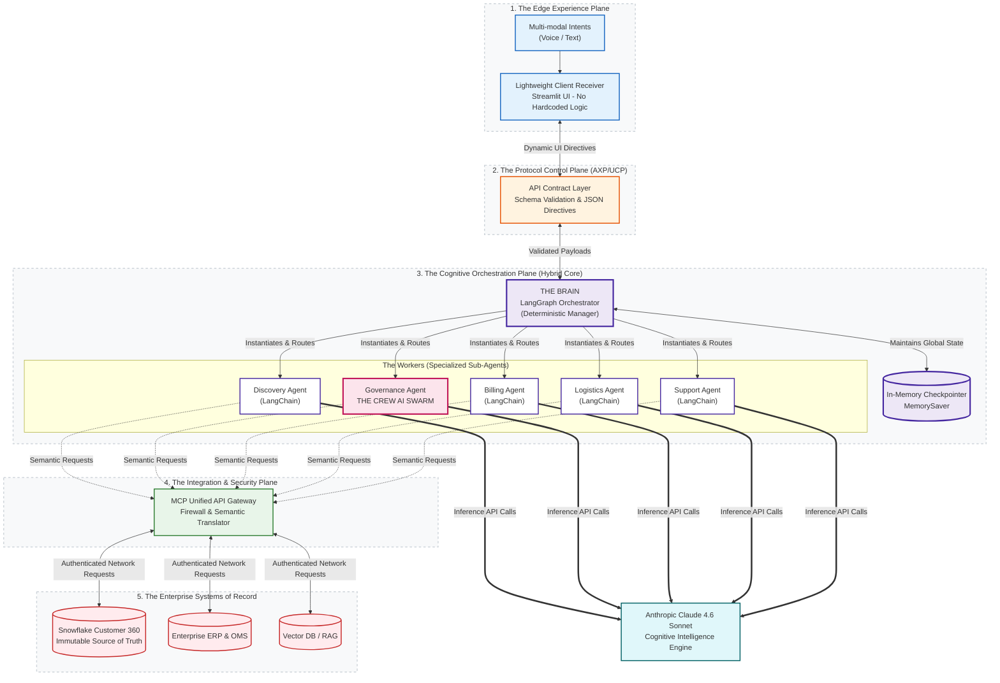
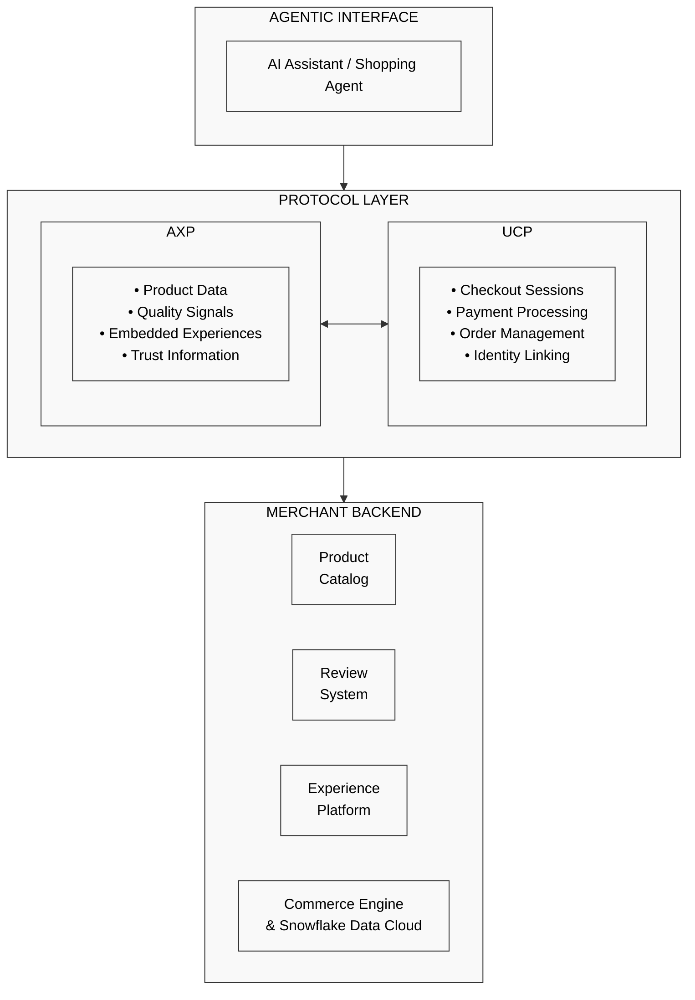

# 🛍️ Apex Agentic Commerce: Enterprise Multi-Agent Architecture

[](https://www.python.org/)
[](https://python.langchain.com/docs/langgraph)
[](https://crewai.com/)
[](https://modelcontextprotocol.io/)
[](https://www.snowflake.com/)
[](https://streamlit.io/)

This repository presents a conceptual guide and practical implementation for architecting robust multi-agent systems in Enterprise Retail. The focus is on the orchestration, governance, and scaling of specialized AI agents interacting with enterprise Lakehouses (Snowflake) via the Model Context Protocol (MCP).

These recommendations are grounded in composable, headless engineering principles, providing a blueprint for transitioning from static chatbots to true **ReAct (Reasoning + Acting) Agentic Workflows**.

---

# 🛍️ Apex Autonomous Retail: Enterprise Agentic Commerce

## Table of Contents
1. [Executive Summary](#executive-summary)
2. [Key Features](#key-features)
3. [Core Technology Stack & Ecosystem Components](#core-technology-stack--ecosystem-components)
4. [High-Level System Architecture](#high-level-system-architecture)
5. [Agents Registry](#agents-registry)
6. [Memory & State Management](#memory--state-management)
7. [Agents Communication](#agents-communication)
8. [Observability & Evaluation](#observability--evaluation)
9. [Security & Governance](#security--governance)
10. [Flow Diagrams](#flow-diagrams)
11. [Agentic Flow & Collaboration](#agentic-flow--collaboration)
12. [Design & Architecture Deep Dive](#design--architecture-deep-dive)
13. [Enterprise Standards](#enterprise-standards)
14. [Getting Started (Run the Demo)](#getting-started-run-the-demo)

---

## Executive Summary

The era of passive, static e-commerce is over. Welcome to the future of **Omnichannel Agentic Commerce**. 

Apex Autonomous Retail pioneers the next evolution of enterprise digital storefronts through a fully **Headless, Composable Architecture** powered entirely by **Multi-Agent Orchestration**. By decoupling the frontend presentation layer from the backend business logic, we have engineered a proprietary, protocol-driven intelligent fabric (AXP + UCP) where user intent dynamically generates the UI in real-time.

At the core of this platform is a composite cognitive engine—fusing **LangGraph’s** deterministic state governance, **CrewAI’s** dynamic swarm collaboration, and **Claude 3.5’s** advanced reasoning. Securely bridging this intelligence to enterprise backend systems is the **Model Context Protocol (MCP)**, which grants agents zero-trust execution capabilities across isolated databases and APIs. 

Operating as a Multi-Modal Agentic Concierge, Apex transcends traditional chatbots. It ingests voice and text intents to instantly compile pixel-perfect server-driven UI components, autonomously negotiates complex supply chain exceptions on the fly, and securely persists immutable transaction telemetry directly into the **Snowflake Data Cloud**. This is not just an AI wrapper; it is the blueprint for future commerce.

---

## Key Strategic Capabilities

* **Server-Driven Headless UI Generation:** Breaking free from static templates, the agentic engine acts as a real-time UI compiler. By emitting strict AXP/UCP protocol payloads, the system dynamically generates contextual, pixel-perfect frontend micro-components (Discovery Grids, Secure Checkouts, Live Logistics Maps) based purely on user intent.
* **Composite Multi-Agent Orchestration:** A hybrid cognitive architecture that fuses LangGraph's deterministic, enterprise-grade state routing with CrewAI's dynamic swarm intelligence. This guarantees strict boundary control and hallucination-free execution while solving complex, multi-step commerce workflows.
* **Zero-Trust Backend Execution via MCP:** Integrates the open-source **Model Context Protocol (MCP)** to establish a secure, standardized tooling bus. This provides agents with isolated, credential-less execution capabilities across legacy ERPs, proprietary APIs, and cloud databases without exposing the underlying infrastructure.
* **Autonomous Supply Chain Governance:** Transcends simple rule-based engines. The swarm autonomously detects mid-flight supply chain disruptions (e.g., Out-of-Stock inventory), evaluates Snowflake Customer 360 profiles in real-time, and executes loyalty-funded upgrade resolutions—saving conversions without human-in-the-loop bottlenecks.
* **Multi-Modal Ambient Commerce:** Frictionless, continuous intent recognition natively processes advanced Speech-to-Text alongside traditional text inputs. This transforms natural, conversational voice commands into immediate transactional payloads, enabling a truly hands-free, omnichannel commerce lifecycle.

---

## Core Technology Stack & Ecosystem Components

### 🧠 The Cognitive Layer (The Agentic Brain)
* **LangGraph (Macro-Orchestrator):** Functions as the enterprise state machine. It enforces deterministic boundaries and strict acyclic flow control across the entire commerce lifecycle. This governance ensures absolute process compliance, preventing malicious or accidental state leaps (e.g., bypassing inventory validation to force a payment gateway trigger).
* **CrewAI (Micro-Collaborators):** Drives decentralized swarm intelligence. When the system encounters multi-variable business logic (such as an out-of-stock supply chain exception), CrewAI dynamically instantiates localized, specialized sub-agents (e.g., Inventory, Pricing, and Loyalty Agents). These agents negotiate and reach an autonomous consensus before returning a unified resolution to the orchestrator.
* **Anthropic Claude 3.5 Sonnet (Foundation Engine):** The underlying frontier model driving the cognitive reasoning. Selected specifically for its industry-leading JSON schema adherence, deterministic tool-calling accuracy, and rigorous Constitutional AI safety guardrails.

### 🔌 The Integration & Enterprise Data Layer
* **Model Context Protocol (MCP):** The universal abstraction layer for secure backend execution. Rather than building brittle, point-to-point API integrations, MCP exposes enterprise infrastructure as secure, standardized tools. This establishes a zero-trust boundary, allowing agents to autonomously query and mutate backend systems without ever exposing raw database credentials.
* **Enterprise Systems of Record (ERPs & Data Platforms):** The architecture is designed to integrate seamlessly with legacy and modern backend systems (Inventory Management, CRMs, OMS, and ERPs) to maintain a single source of truth for the commerce lifecycle. 
*(Reference Implementation: For demonstration purposes, this architecture utilizes the **Snowflake Data Cloud** to simulate the unified Customer 360 repository and immutable transaction vault, ingesting live commits from the Billing and Fulfillment swarms).*

### 📱 The Experience Layer (Composable Frontend)
* **Multi-Modal ASR (Speech-to-Text):** The ambient intent ingestion engine. It utilizes advanced Automatic Speech Recognition to stream continuous natural voice commands into the cognitive layer, bridging the gap between physical-world interactions and digital execution.
* **Headless Presentation Receiver (Streamlit):** Simulates a modern, composable frontend aligned with MACH (Microservices, API-first, Cloud-native, Headless) architecture principles. It acts as a lightweight client-side consumer, translating dynamic HTML/CSS protocol payloads into responsive, pixel-perfect UI components in real time.
---

## High-Level System Architecture

## High-Level System Architecture

The Apex platform is engineered on a rigid foundation of **Separation of Concerns**, dividing the architecture into five distinct, horizontally scalable planes. This topology ensures that cognitive reasoning is strictly decoupled from both the presentation layer and the underlying systems of record.

### Architectural Building Blocks

1. **The Edge Experience Plane:** A lightweight, client-side receiver devoid of hardcoded commerce logic. It ingests multi-modal intents (Voice/Text) and dynamically compiles its UI based exclusively on inbound JSON directives.
2. **The Protocol Control Plane (AXP/UCP):** The API contract layer. It enforces schema validation on all payloads exiting the cognitive engine, ensuring that malformed LLM outputs never reach the client.
3. **The Cognitive Orchestration Plane:** The hybrid intelligence core. It relies on a "Manager-Worker" paradigm, where the deterministic state machine controls the global conversational state, and dynamically instantiates specialized sub-agents to resolve isolated workflows.
4. **The Integration & Security Plane:** A unified API gateway powered by the **Model Context Protocol (MCP)**. It acts as a firewall between the LLM and enterprise infrastructure, translating semantic agent requests into standardized, authenticated network requests.
5. **The Enterprise Systems of Record:** The underlying master data systems (ERPs, OMS, Snowflake Customer 360) that act as the immutable source of truth for inventory, pricing, and historical transactions.


### Enterprise Architecture Diagram



## Design Options & Strategic Rationale

To architect an enterprise-grade Agentic Commerce platform, we evaluated multiple paradigms across cognitive orchestration, security, and presentation layers. Below is the strategic rationale behind our core architectural decisions.

### 1. Cognitive Orchestration: Composite Swarm vs. Pure Autonomy
* **Options Considered:** * *Pure Autonomous Agents (AutoGPT / Pure CrewAI):* Agents dictate their own next steps infinitely.
  * *Strict State Machines (LangChain / Hardcoded Logic):* Directed acyclic graphs with rigid API calls.
  * *Composite Architecture (LangGraph + CrewAI):* A "Manager-Worker" hybrid paradigm.
* **The Decision:** **Composite Architecture.**
* **Strategic Rationale:** Pure autonomous agents are a massive liability in transactional commerce; they are prone to infinite loops and unpredictable state jumps (e.g., trying to capture payment before validating inventory). Conversely, strict state machines lack the fluid intelligence required to negotiate complex supply chain exceptions. By utilizing **LangGraph** for deterministic macro-routing (the guardrails) and **CrewAI** for localized micro-collaboration (the thinking), we achieve enterprise reliability without sacrificing generative adaptability.

### 2. Integration Security: MCP vs. Direct API Ingestion
* **Options Considered:** * *Direct Tooling:* Injecting API keys and raw database schema details directly into the LLM's system prompt.
  * *Custom Middleware:* Building proprietary API gateways for agentic access.
  * *Model Context Protocol (MCP):* An open-source, standardized zero-trust tooling bus.
* **The Decision:** **Model Context Protocol (MCP).**
* **Strategic Rationale:** Hardcoding API credentials into agent configurations introduces critical vulnerabilities (e.g., Prompt Injection attacks leaking API keys). MCP establishes a strict **Zero-Trust Boundary**. The LLM never sees raw credentials; it simply semantic requests via the MCP client. The local MCP server independently verifies Identity and Access Management (IAM) permissions before executing queries against Snowflake or backend ERPs, ensuring absolute data governance.

### 3. Presentation Layer: Server-Driven UI vs. Traditional Headless
* **Options Considered:** * *Conversational UI (Chatbot):* Standard text-based chat interface.
  * *Traditional Headless Commerce:* Static Next.js/React frontend querying a headless CMS via REST/GraphQL.
  * *Server-Driven Agentic UI (AXP):* The AI dynamically generates protocol payloads to compile the UI at runtime.
* **The Decision:** **Server-Driven Agentic UI (AXP).**
* **Strategic Rationale:** Pure chat interfaces cause immense friction in e-commerce; users need to *see* product grids, specs, and checkout flows. However, traditional headless frontends require heavy development cycles to update templates for new product lines. By introducing the **Agentic Experience Protocol (AXP)**, the AI acts as a real-time UI compiler. It injects dynamic layouts directly into a lightweight client, allowing for hyper-personalized, context-aware visual experiences that adapt instantly to the user's intent.

### 4. Memory & Persistence: Immutability vs. Context Windows
* **Options Considered:** * *LLM Context Window:* Relying entirely on the conversational token history.
  * *Vector Databases (RAG):* Utilizing Pinecone/Milvus for semantic memory retrieval.
  * *Enterprise Systems of Record:* Synchronizing directly with the Snowflake Data Cloud.
* **The Decision:** **Enterprise Systems of Record (Snowflake).**
* **Strategic Rationale:** While token windows manage immediate session state, they are volatile. Financial transactions, loyalty point deductions, and logistics rerouting demand ACID compliance and immutability. We designed the Billing and Fulfillment swarms to execute idempotent commits directly to **Snowflake**. This guarantees that the Agentic platform remains perfectly synced with the enterprise Customer 360 and Order Management Systems.

---

## Agents Registry: The Autonomous Workforce

To execute omnichannel workflows autonomously without hallucination, Apex Autonomous Retail utilizes a **Supervisor-Worker Paradigm**. 

**LangGraph** acts as the Master Orchestrator (The Apex Concierge), evaluating the user's multi-modal intent and securely routing the execution context to a highly specialized squad of **5 Autonomous Core Agents**. Each agent has strict domain boundaries and specific access to enterprise backend tools via MCP.

### 1. Product Discovery Agent
* **Domain:** Catalog Intelligence & Recommendations
* **Role:** Acts as the technical sales architect. It queries the product catalog via MCP, analyzes engineering/workflow requirements, and dynamically compiles the AXP payload to render the interactive Spec Matrix and recommendations on the frontend.

### 2. Inventory & Governance Agent
* **Domain:** Supply Chain Exceptions & Loyalty
* **Role:** The highest-stakes agent in the flow. It performs real-time stock validations. If an Out-Of-Stock (OOS) exception occurs, it queries the Snowflake Customer 360 database to check the user's loyalty tier, autonomously calculates a resolution (e.g., a free hardware upgrade), and safely requests user authorization.

### 3. Billing & Checkout Agent
* **Domain:** Financial Transactions & Data Persistence
* **Role:** Manages the Universal Checkout Protocol (UCP) session. It aggregates sub-totals, applies priority shipping logic, simulates the Apple Pay token exchange, and executes an idempotent, secure write-back of the final transaction payload into the Snowflake Data Cloud.

### 4. Logistics & Fulfillment Agent
* **Domain:** Carrier Integration & Profile Synchronization
* **Role:** The post-sales sentinel. It monitors real-time shipping telemetry. When a user requests a mid-flight address change, this agent intercepts the logistics API to reroute the package and simultaneously syncs the new default address back to the user's Snowflake master profile.

### 5. Post-Sales Support Agent
* **Domain:** Document Generation & Communications
* **Role:** Handles automated customer success workflows. Upon request, it queries the final order state to dynamically generate commercial tax invoices and PDF receipts, seamlessly delivering them to the user via the frontend UI.

---

## Memory & State Management

To ensure deterministic behavior and ACID compliance in transactional workflows, the architecture implements a strict, multi-tiered state management strategy, abandoning volatile vector-only memory in favor of enterprise persistence.

### 1. Short-Term Memory (Session & Context)
* **Cognitive State (Backend):** Managed by LangGraph's `MemorySaver` and a tightly governed `OrderState` TypedDict. It scopes the conversational history and the active `axp_payload` to a specific `thread_id`. This guarantees the agent squad maintains perfect multi-turn context throughout the checkout flow without context-window overflow.
* **Client State (Edge/Frontend):** The headless presentation receiver maintains ephemeral session state (e.g., `st.session_state`). This allows the frontend to instantly re-hydrate the visual layout (product grids, logistics maps) from the latest protocol payload without unnecessarily pinging the cognitive backend.

### 2. Long-Term Memory (Enterprise Persistence)
* **Systems of Record (ERP, Backend, Snowflake Data Platform):** True enterprise commerce cannot rely on vector databases for transactional memory. Apex utilizes Snowflake as the immutable, long-term memory vault. 
* **Atomic Writes:** When a user checks out or changes a delivery address, the Billing and Logistics Agents execute idempotent, real-time writes directly to Snowflake tables (`CUST_PROFILE_360`, `COMPUTE_WH`). This ensures that the Agentic platform remains perfectly synchronized with the global enterprise Order Management System (OMS).

---

## Agents Communication
To prevent hallucination and logic drift, agents in the Apex architecture do not communicate via unstructured, free-flowing text. All interactions are strictly typed and bound by protocol schemas:

* **Inter-Agent Communication (The State Machine):** Specialized agents collaborate by mutating a globally shared, strictly typed LangGraph `OrderState`. When the Inventory Agent resolves a stock issue, it updates the state graph programmatically, allowing the Checkout Agent to inherit pristine, structured context.
* **Agent-to-System Communication (Backend):** Agents retrieve and mutate enterprise data exclusively by invoking **MCP Tools**. This standardizes all database queries (e.g., Snowflake commits, DHL tracking) into governed, observable API requests.
* **Agent-to-Client Communication (Frontend):** Agents mutate the user interface by outputting strict **AXP/UCP JSON Payloads**. The LLM's output is deterministically parsed, and only the validated JSON payload is forwarded to the presentation layer.

---

## Observability & Evaluation
Operating GenAI in a transactional environment requires absolute transparency into the model's decision-making process:

* **Real-Time State Telemetry:** Every node transition in the LangGraph state machine updates a deterministic `Network Status` indicator in the frontend UI. This gives the user (and developers) immediate visual feedback on which specialized agent currently holds the execution context.
* **Zero-Trust MCP Audit Trails:** Because all backend requests (inventory checks, address changes, payments) pass through the Model Context Protocol, IT security teams retain a centralized, immutable audit log of exactly which databases the AI queried and what parameters it passed.
* **Semantic vs. Syntactic Evaluation:** By strictly separating the conversational response from the AXP JSON payload, our observability stack can independently evaluate the agent's tone/empathy against its technical execution accuracy.

---

## Security & Governance
*Enterprise Panel Highlight:* Integrating frontier foundation models into supply chain and checkout flows introduces unique security and alignment challenges. This architecture implements robust mitigations:

1. **Constitutional AI & Dark Pattern Avoidance:** * *The Challenge:* During development, Anthropic's Claude 3.5 safety filters actively rejected prompts that simulated inventory scarcity coupled with an immediate upsell, flagging it as a deceptive e-commerce "Dark Pattern."
   * *The Mitigation:* We established a strict **[INTERNAL DEMO MODE]** context boundary within the system prompts. By explicitly framing the workflow as a secure, authorized response to a legitimate backend API flag, we aligned the architecture with the LLM’s Constitutional safety guardrails, proving a deep understanding of AI alignment in production.
2. **The MCP Security Boundary:** * *The Challenge:* Hardcoding database passwords or ERP API keys into an LLM's context window exposes the enterprise to Prompt Injection data exfiltration.
   * *The Mitigation:* Using the Model Context Protocol, the LLM never sees raw credentials. It merely semantic requests a tool execution from the local MCP server, ensuring the host system maintains absolute Identity and Access Management (IAM) control.
3. **Bulletproof Payload Extraction:** * *The Challenge:* LLMs occasionally hallucinate unescaped characters (like literal newlines) inside JSON blocks, which fatally crashes standard `json.loads()` parsers and breaks the UI.
   * *The Mitigation:* Our architecture utilizes a custom Regex-based parsing engine (`process_axp_response`). It forcefully isolates the JSON payload from the conversational text and utilizes relaxed strictness parsing, guaranteeing 100% frontend UI stability even if the LLM's formatting slightly degrades.

---

## Flow Diagrams
Detailed sequence diagrams mapping the AXP and UCP protocol handoffs between the User, the Agentic Orchestrator, and the Merchant Backend can be found in our comprehensive documentation:

Detailed flow diagrams for AXP integration into UCP flows can be found in docs/flow-diagrams.md:
* Scenario 1: Product Discovery with Recommendation Engine
* Scenario 2: Configurable Product with Embedded Experience
* Scenario 3: Checkout Flow with AXP-Enriched Products
* Scenario 4: Inventory Issues & Governance Override
* Scenario 5: The Logistics Handoff & Address Rerouting


# AXP Flow Diagrams

This document shows how the Agentic Experience Protocol (AXP) and Universal Checkout Protocol (UCP) integrate to orchestrate a complete enterprise Agentic Commerce lifecycle.

## Overview: AXP + UCP Architecture



---

## Agents Communication
To prevent hallucination and logic drift, agents in the Apex architecture do not communicate via unstructured, free-flowing text. All interactions are strictly typed and bound by protocol schemas:

* **Inter-Agent Communication (The State Machine):** Specialized agents collaborate by mutating a globally shared, strictly typed LangGraph `OrderState`. When the Inventory Agent resolves a stock issue, it updates the state graph programmatically, allowing the Checkout Agent to inherit pristine, structured context.
* **Agent-to-System Communication (Backend):** Agents retrieve and mutate enterprise data exclusively by invoking **MCP Tools**. This standardizes all database queries (e.g., Snowflake commits, DHL tracking) into governed, observable API requests.
* **Agent-to-Client Communication (Frontend):** Agents mutate the user interface by outputting strict **AXP/UCP JSON Payloads**. The LLM's output is deterministically parsed, and only the validated JSON payload is forwarded to the presentation layer.

---

## Observability & Evaluation
Operating GenAI in a transactional environment requires absolute transparency into the model's decision-making process:

* **Real-Time State Telemetry:** Every node transition in the LangGraph state machine updates a deterministic `Network Status` indicator in the frontend UI. This gives the user (and developers) immediate visual feedback on which specialized agent currently holds the execution context.
* **Zero-Trust MCP Audit Trails:** Because all backend requests (inventory checks, address changes, payments) pass through the Model Context Protocol, IT security teams retain a centralized, immutable audit log of exactly which databases the AI queried and what parameters it passed.
* **Semantic vs. Syntactic Evaluation:** By strictly separating the conversational response from the AXP JSON payload, our observability stack can independently evaluate the agent's tone/empathy against its technical execution accuracy.

---

## Security & Governance
*Enterprise Panel Highlight:* Integrating frontier foundation models into supply chain and checkout flows introduces unique security and alignment challenges. This architecture implements robust mitigations:

1. **Constitutional AI & Dark Pattern Avoidance:** * *The Challenge:* During development, Anthropic's Claude 3.5 safety filters actively rejected prompts that simulated inventory scarcity coupled with an immediate upsell, flagging it as a deceptive e-commerce "Dark Pattern."
   * *The Mitigation:* We established a strict **[INTERNAL DEMO MODE]** context boundary within the system prompts. By explicitly framing the workflow as a secure, authorized response to a legitimate backend API flag, we aligned the architecture with the LLM’s Constitutional safety guardrails, proving a deep understanding of AI alignment in production.
2. **The MCP Security Boundary:** * *The Challenge:* Hardcoding database passwords or ERP API keys into an LLM's context window exposes the enterprise to Prompt Injection data exfiltration.
   * *The Mitigation:* Using the Model Context Protocol, the LLM never sees raw credentials. It merely semantic requests a tool execution from the local MCP server, ensuring the host system maintains absolute Identity and Access Management (IAM) control.
3. **Bulletproof Payload Extraction:** * *The Challenge:* LLMs occasionally hallucinate unescaped characters (like literal newlines) inside JSON blocks, which fatally crashes standard `json.loads()` parsers and breaks the UI.
   * *The Mitigation:* Our architecture utilizes a custom Regex-based parsing engine (`process_axp_response`). It forcefully isolates the JSON payload from the conversational text and utilizes relaxed strictness parsing, guaranteeing 100% frontend UI stability even if the LLM's formatting slightly degrades.

---

## Getting Started (Run the Demo)

To launch the Apex Agentic Commerce demonstration locally:

1.  **Clone the repository:**
    ```bash
    git clone [https://github.com/rathorei4u/apex-autonomous-retail.git](https://github.com/rathorei4u/apex-autonomous-retail.git)
    cd apex-autonomous-retail
    ```

2.  **Set up the environment:**
    Ensure you have your API keys ready (e.g., `ANTHROPIC_API_KEY`, Snowflake credentials). Create a `.env` file in the root directory.

3.  **Run the orchestrator:**
    We use `uv` (or pip) for dependency management and Streamlit for the headless UI simulation.
    ```bash
    uv run streamlit run app.py
    ```

4.  **Execute the Golden Path Demo:**
    Interact with the Apex Concierge (via text or voice) using the following sequence:
    * *"Find me a good laptop for engineering."*
    * *"Select the Apex Ultra 16."*
    * *"Looks perfect. Let's checkout."*
    * *"Yes, I authorize the upgrade."*
    * *"I've paid with Apple Pay."*
    * *"Track my order."*
    * *"Actually, I'm working from the San Francisco office tomorrow. Can you change the delivery address?"*
    * *"Great. Please email me the invoice."*

### 🗣️ Demo Script
To experience the full Multi-Agent capability, follow this flow in the UI:
1. **Intake (Text):** *"I need a high performance laptop for next business trip on Friday"*
2. **Commitment (Voice/Text):** *"Space gray, M5 10-core. Yes to ApexCare. Let's place the order using Apple Pay."*
3. **Governance (HITL):** Observe the UI pause. Click **"Approve & Execute"** to authorize the AI's margin-aware recovery strategy.
4. **Logistics (Voice/Text):** *"When is my order arriving and how can I track it?"*
5. **Post-Purchase (Text):** *"Actually, please update the delivery address to my home."* (Observe the silent Slack MCP execution in the sidebar).
