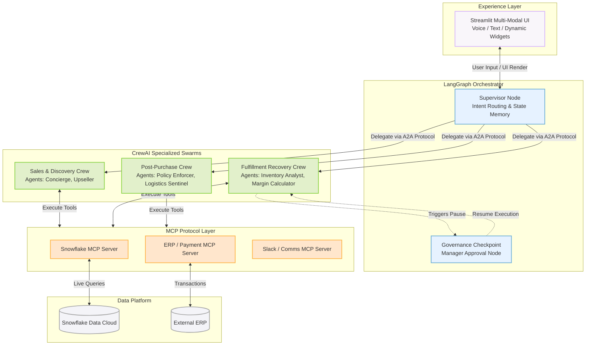
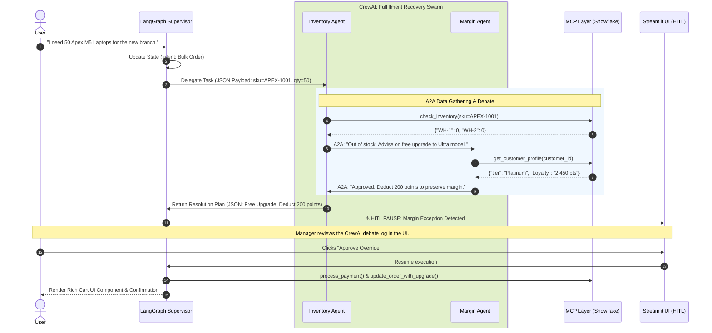

# 🛍️ Apex Agentic Commerce: Enterprise Multi-Agent Architecture

[](https://www.python.org/)
[](https://python.langchain.com/docs/langgraph)
[](https://crewai.com/)
[](https://modelcontextprotocol.io/)
[](https://www.snowflake.com/)
[](https://streamlit.io/)

This repository presents a conceptual guide and practical implementation for architecting robust multi-agent systems in Enterprise Retail. The focus is on the orchestration, governance, and scaling of specialized AI agents interacting with enterprise Lakehouses (Snowflake) via the Model Context Protocol (MCP).

These recommendations are grounded in composable, headless engineering principles, providing a blueprint for transitioning from static chatbots to true **ReAct (Reasoning + Acting) Agentic Workflows**.

---

## 📑 Table of Contents
1. [Executive Summary](#-executive-summary)
2. [Key Features](#-key-features)
3. [Core Technology Stack](#-core-technology-stack)
4. [High-Level System Architecture](#-high-level-system-architecture)
5. [Agentic Flow & Collaboration](#-agentic-flow-a2a-collaboration--resolution)
6. [Design & Architecture Deep Dive](#-design--architecture-deep-dive)
7. [Enterprise Standards](#-enterprise-standards)
8. [Getting Started (Run the Demo)](#-getting-started)

---

## 📖 Executive Summary
Generative AI is advancing rapidly, shifting the paradigm from "LLMs as text generators" to "LLMs as system orchestrators." 

Apex Autonomous Commerce is a production-grade Reference Architecture that decouples conversational UI from enterprise business logic using a **Supervisor-Worker Paradigm**. Designed as a vendor-agnostic, scalable alternative to rigid CRM chatbots, this system utilizes **LangGraph** as a stateful orchestrator that delegates complex supply chain and commerce intents to specialized **CrewAI Swarms**. 

These swarms communicate via strict **A2A (Agent-to-Agent) JSON protocols** and autonomously navigate complex business logic—including Out-of-Stock (OOS) recovery, proactive logistics rerouting, and ERP write-backs—without human intervention, while maintaining a premium conversational interface.

---

## 🌟 Key Features
* **Multi-Modal Voice Integration:** Seamlessly transition between text and speech-to-text (Whisper/SpeechRecognition) at the edge, maintaining continuous agentic context.
* **Controllable Autonomy (HITL):** LangGraph checkpointers freeze execution before critical ERP or payment actions, enforcing strict enterprise governance and manager sign-off.
* **Dynamic UI Generation:** The AI doesn't just return text; it triggers rich Streamlit components (product cards, metric dashboards) based on real-time data retrieval.
* **Asynchronous Omni-Channel:** Agents act independently in the background, firing off Slack notifications to fulfillment centers without needing explicit user instruction.

---

## 🏗️ Core Technology Stack
* **Reasoning Engine:** Anthropic Claude 3.5 Sonnet (Optimized for complex tool calling).
* **Experience Layer (UI):** Streamlit (Multi-Modal Voice + Chat, Headless, Dynamic UI generation).
* **State & Governance (The Supervisor):** LangGraph (Manages session memory, contextual routing, and Human-in-the-Loop checkpoints).
* **Agentic Collaboration (The Workers):** CrewAI (Creates specialized agent crews that debate and collaborate to resolve edge cases).
* **Integration Standard (The Bridge):** Model Context Protocol (MCP) servers (Provides a standardized, secure bridge to enterprise APIs).
* **Data Lakehouse:** Snowflake (Customer 360, Live Inventory, Order Management).

---

## 📐 High-Level System Architecture

This architecture ensures high fault tolerance and modularity. The orchestrator routes user intents to the correct swarm, ensuring the top-of-funnel Sales Swarm is completely isolated from the backend Logistics Swarm.



---

## 🔄 Agentic Flow: A2A Collaboration & Resolution

**Demo Scenario:** A VIP B2B customer wants to order laptops, but the primary warehouse is out of stock. Instead of dropping the sale, the LangGraph Supervisor wakes up the Fulfillment Recovery Crew. The Inventory Agent and Margin Agent debate via A2A communication, agreeing to absorb upgrade costs using loyalty points to save the deal. The system then pauses for Human-in-the-Loop (HITL) approval.



---

## 🧠 Design & Architecture Deep Dive

### Design Options
When designing multi-agent systems, architects must choose between Decentralized Swarms (agents operating independently) and Centralized Orchestrators. 
**Our Approach:** We utilize a **Centralized ReAct Orchestrator**. LangGraph acts as the state machine (`stage_manager_node`), dictating the bounds of the conversation, while Claude is given autonomy *within* those bounds to select MCP tools.

### Agents Registry
Instead of disparate scripts, the system relies on dynamic personas executed by the primary reasoning engine:
- **Concierge Agent:** Handles discovery, configuration, and upsells (ApexCare+).
- **Recovery Swarm Agent:** Authorized to perform margin-aware resolutions (e.g., deducting 200 Loyalty Points for an Ultra upgrade).
- **Logistics Sentinel Agent:** Monitors external carrier telemetry and executes reroutes (e.g., bypassing a Memphis storm via DHL).
- **Policy Enforcer Agent:** Validates warehouse picking status before executing instant ERP cancellations.

### Memory
The architecture utilizes a Dual-Memory design to prevent "Agent Amnesia":
1. **Short-Term (Conversational Context):** Managed by LangGraph's `OrderState`, tracking the `messages` array and dynamic intent variables (like `active_sku`) throughout a single session.
2. **Long-Term (Persistent Context):** Managed via the `manage_customer_memory` MCP tool, allowing agents to store facts (e.g., "Traveling on Friday") back to the Enterprise Database for future interactions.

### Agents Communication
Communication is handled via a **Shared State Schema** (The "Digital Folder"). Rather than passing raw strings between agents, the system passes a typed dictionary containing the conversation history, the active SKU, and the customer ID. This allows tools (like `process_payment` and `create_order`) to execute transactionally based on shared context.

---

## 🛡️ Enterprise Standards

### Governance
To prevent AI hallucination during critical transactions (like taking payments), the `stage_manager_node` enforces strict transitions. The AI cannot access the "Post-Purchase" tools (like `update_delivery_address`) until the Stage Manager confirms the "Intake" stage is complete.

### Security
- **API Boundary:** The LLM does not write SQL. It communicates exclusively via bounded Python functions (MCP tools).
- **Authentication:** Model access is secured via API keys (or corporate LLM Gateways) managed securely in `.env` files.
- **Data Privacy:** PII and addresses are fetched dynamically during the session and are never hardcoded into the system prompts.

### Observability
Agentic workflows are naturally opaque. This architecture implements a "Glass-Box" observability pattern. 
By utilizing Streamlit's sidebar, all Agent-to-Agent (A2A) communications and MCP Tool executions are surfaced to the UI in real-time, allowing engineers and stakeholders to verify that the AI is executing the `check_inventory` or `update_delivery_address` tools securely.

### Evaluation
Testing multi-agent systems requires simulating full business lifecycles rather than single prompts. This repository evaluates success across a 4-turn journey:
1. Intent Recognition & Config.
2. Transaction Execution & Conflict Recovery.
3. Proactive Telemetry Monitoring.
4. Transactional Write-Backs (Address Updates/Invoicing).

---

## 🚀 Getting Started

### Prerequisites
* Python 3.12+
* [uv](https://docs.astral.sh/uv/) (Fast Python package installer)

### Installation
1. Clone the repository:
   ```bash
   git clone [https://github.com/YourUsername/apex-autonomous-retail.git](https://github.com/YourUsername/apex-autonomous-retail.git)
   cd apex-autonomous-retail
   ```
2. Set up the virtual environment and install dependencies:
   ```bash
   uv venv
   source .venv/bin/activate  # On Windows use: .venv\Scripts\activate
   uv add SpeechRecognition streamlit langchain-anthropic langgraph python-dotenv
   ```
3. Configure Environment Variables:
   Create a `.env` file in the root directory and add your API keys:
   ```env
   ANTHROPIC_API_KEY=your_claude_key_here
   ```

### Running the Demo
Start the Streamlit Experience Layer:
```bash
uv run streamlit run app.py
```

### 🗣️ Demo Script
To experience the full Multi-Agent capability, follow this flow in the UI:
1. **Intake (Text):** *"I need a high performance laptop for next business trip on Friday"*
2. **Commitment (Voice/Text):** *"Space gray, M5 10-core. Yes to ApexCare. Let's place the order using Apple Pay."*
3. **Governance (HITL):** Observe the UI pause. Click **"Approve & Execute"** to authorize the AI's margin-aware recovery strategy.
4. **Logistics (Voice/Text):** *"When is my order arriving and how can I track it?"*
5. **Post-Purchase (Text):** *"Actually, please update the delivery address to my home."* (Observe the silent Slack MCP execution in the sidebar).
