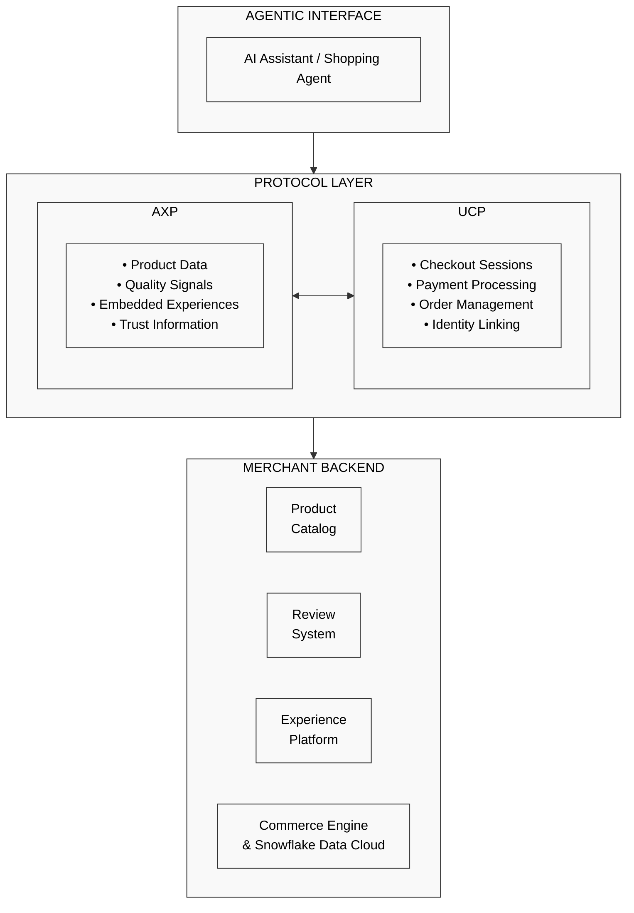
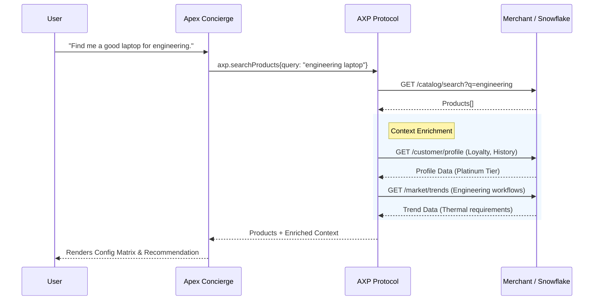
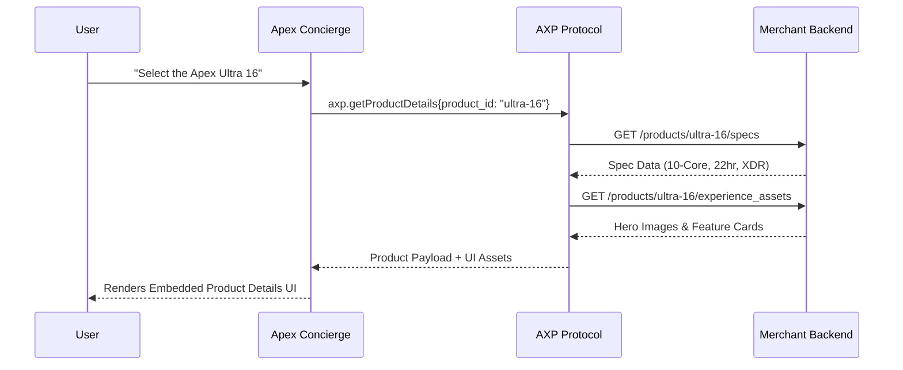
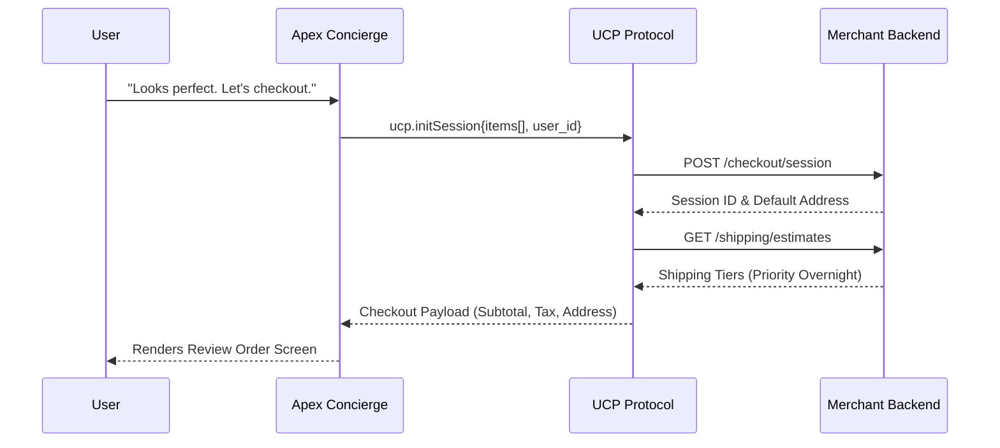
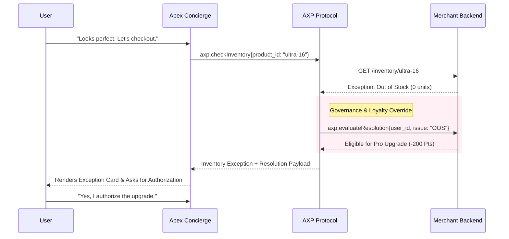

# AXP Flow Diagrams

This document shows how the Agentic Experience Protocol (AXP) and Universal Checkout Protocol (UCP) integrate to orchestrate a complete enterprise Agentic Commerce lifecycle.

## Overview: AXP + UCP Architecture



---

## Scenario 1: Product Discovery with Recommendation Engine
The agent searches for products and enriches the response with loyalty data, customer profiles, and market trends.



---

## Scenario 2: Configurable Product with Embedded Experience
The user selects a product, and the agent retrieves deep configuration details to render the embedded UI experience.



---

## Scenario 3: Checkout Flow with AXP-Enriched Products
The user proceeds to checkout. The system transitions from AXP (Discovery) to UCP (Universal Checkout Protocol) to stage the order.



---

## Scenario 4: Inventory Issues & Governance Override
The agent attempts to stage an order, discovers an inventory exception, and autonomously negotiates a loyalty-based upgrade.



---

## Scenario 5: The Logistics Handoff & Address Rerouting
Post-sales flow where the user tracks the order and triggers a mid-flight address update, sinking data back to Snowflake.

```mermaid
sequenceDiagram
    participant User
    participant Agent as Apex Concierge
    participant UCP as UCP Protocol
    participant Backend as Snowflake Data Cloud

    User->>Agent: "Can you change the delivery address to my home?"
    Agent->>UCP: ucp.updateFulfillment{order_id, new_address: "Home"}
    UCP->>Backend: POST /logistics/reroute (DHL API)
    Backend-->>UCP: Success (Intercepted)
    
    rect rgb(240, 255, 240)
        Note right of UCP: Snowflake Profile Update
        UCP->>Backend: PUT /customer_360/preferences
        Backend-->>UCP: 200 OK (Profile Updated)
    end
    
    UCP-->>Agent: Reroute Confirmation Payload
    Agent
